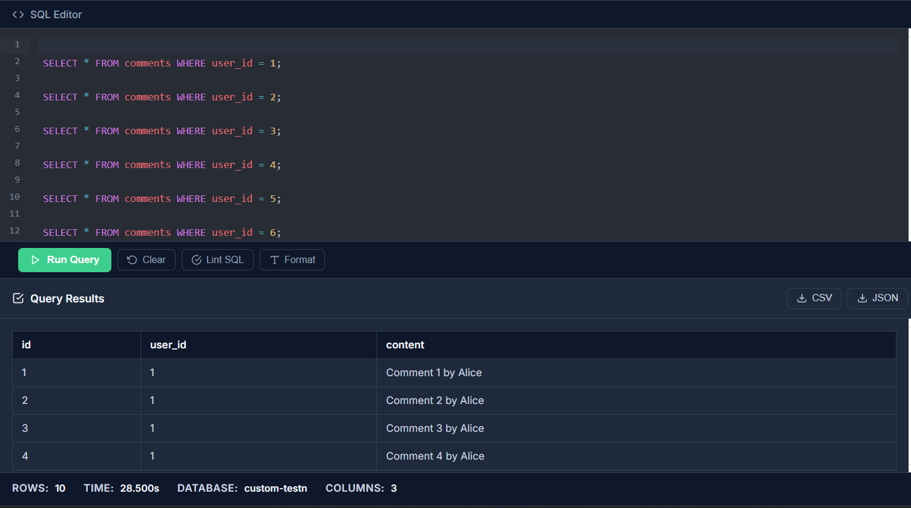
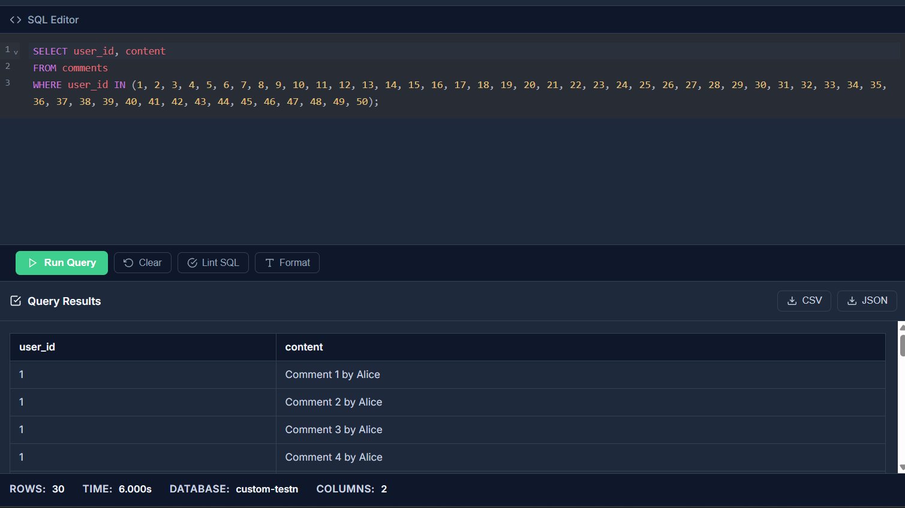

# 📉 Vấn đề N+1 Query và Các Chiến Lược Tối Ưu Hóa I/O Database

Vấn đề N+1 Query là một trong những lỗi hiệu suất phổ biến nhất khi làm việc với Database thông qua các công cụ ORM (Object-Relational Mapping). Nó dẫn đến việc thực hiện hàng loạt truy vấn nhỏ không cần thiết, gây tăng độ trễ và quá tải hệ thống.

---

## 1. ❓ N+1 Query: Vấn đề Cốt Lõi

### Context:

Giả sử chúng ta có hai bảng liên kết: `users` (người dùng) và `comments` (bình luận). Mục tiêu là lấy **tất cả user name và số lượng comment** của họ.

### Cơ chế (Không tối ưu):

Quá trình thường diễn ra theo 2 bước:

1.  **Query 1:** Lấy danh sách $N$ người dùng: `getUsers()` (1 lần gọi DB).
2.  **Vòng lặp:** Với mỗi người dùng trong danh sách, ta thực hiện một truy vấn riêng biệt để lấy comments của họ. ($N$ lần gọi DB).

### Minh họa:

- Nếu có **101 users**, tổng số lần gọi Database là: $1 (\text{lấy users}) + 101 (\text{lấy comments}) = **102**$ lần.
- Nếu có hàng triệu users, số lần tương tác với Database cũng lên đến hàng triệu lần.

### Ví dụ Thực tế:

Giống như khi bạn cần mua 200 món đồ, thay vì liệt kê vào một danh sách và đi một lần, bạn lại đi mua từng món một, tốn công di chuyển 200 lần. Mỗi "chuyến đi" (Round-Trip) tốn chi phí và thời gian.

### Hậu quả:

- Tạo ra nhiều **Round-Trip** không cần thiết giữa ứng dụng và Database.
- Làm chậm website (**slow down**).
- Gây quá tải Database.

---

## 2. 🚀 Giải pháp: Tối ưu hóa I/O Database

Thay vì thực hiện nhiều lượt tương tác (Round-Trip), mục tiêu là gộp chúng lại và thực hiện trong **1 hoặc 2 lần truy vấn duy nhất** để trả về kết quả. Đây chính là nguyên tắc của **Batch I/O(đại diện cho truyền tải dữ liệu giữa ứng dụng và database)**.

### Batch I/O:

Nói đơn giản: Thay vì phải thực hiện $N$ lượt đi/về (Round-Trip), ta sẽ gộp tất cả yêu cầu vào một lần duy nhất. Giống như việc đi một chuyến và cầm theo một danh sách mua sắm đầy đủ.

---

## 3. 🎯 Các Chiến Lược Tối Ưu (Sách Lược)

Để giải quyết N+1, chúng ta có hai chiến lược chính:

### 3.1. Eager Loading (Tải Chủ động)

Đây là cách phổ biến nhất trong ORM.

- **Cơ chế:** Thường sử dụng cú pháp như `JOIN FETCH` (trong JPA/Hibernate). Khi lấy đối tượng "cha" (User), ta yêu cầu nó lấy luôn dữ liệu của đối tượng "con" (Comments) trong cùng một truy vấn.
- **Kết quả:** Chỉ 1 lần gọi Database, sử dụng phép `JOIN` để lấy tất cả dữ liệu liên quan.

### 3.2. Batching (Gộp Lô) / Tự Viết Query

Chiến lược này thường được áp dụng bởi ORM (Subselect Fetching) hoặc tự viết thủ công.

- **Cơ chế:**
  1.  **Query 1:** Lấy hết các ID của đối tượng cha (User IDs).
  2.  **Query 2:** Viết một câu lệnh truy vấn duy nhất để lấy dữ liệu con cho tất cả các ID đã nhận.
      - Ví dụ: `SELECT * FROM comments WHERE parent_id IN (list_of_user_ids)`
- **Kết quả:** Chỉ 2 lần gọi Database, tránh được hiện tượng nhân bản dữ liệu có thể xảy ra khi dùng Eager Loading bằng `JOIN`.

---

## 4. ⚠️ Các Thách Thức và Lưu ý Khi Tối Ưu

Việc tối ưu cũng cần được cân nhắc kỹ lưỡng để tránh tạo ra các vấn đề hiệu suất khác:

- **Đặt kích thước lô quá lớn:** Danh sách ID trong mệnh đề `IN` quá dài có thể gây áp lực lên cả bộ nhớ ứng dụng và Database. Cần cấu hình Batch Size hợp lý (ví dụ: 10, 50, 100).
- **Lạm dụng Eager Loading:** Lấy một đống dữ liệu không cần thiết (kể cả khi không dùng) sẽ làm tăng kích thước payload và chậm thời gian tải query. Hãy sử dụng Eager Loading một cách có chọn lọc.
- **Sử dụng `OFFSET` để phân trang cho list dữ liệu quá to:**
  - `OFFSET` buộc Database phải quét qua và bỏ qua $K$ hàng đầu tiên, rất chậm với các bảng lớn.
  - **Giải pháp nên dùng:** **Cursor Pagination** (sử dụng điều kiện `WHERE id > [last_id]` hoặc tương tự) để tăng tốc độ phân trang.
- **Vấn đề:** N+1.

### Kết luận:

Vấn đề N+1 tạo ra các Round-Trip không cần thiết. Các kỹ thuật **Batching** và **Eager Loading** là chìa khóa giúp giảm thiểu số lượng tương tác với Database, qua đó cải thiện đáng kể hiệu suất ứng dụng.# N-1_SOLUTION_PRACTICE

### Example Test

